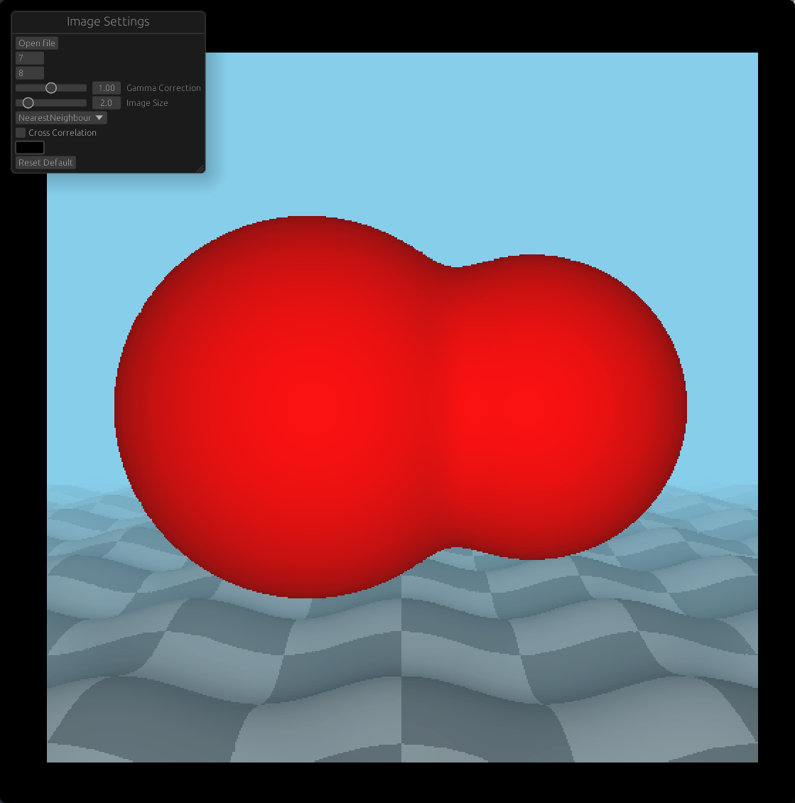
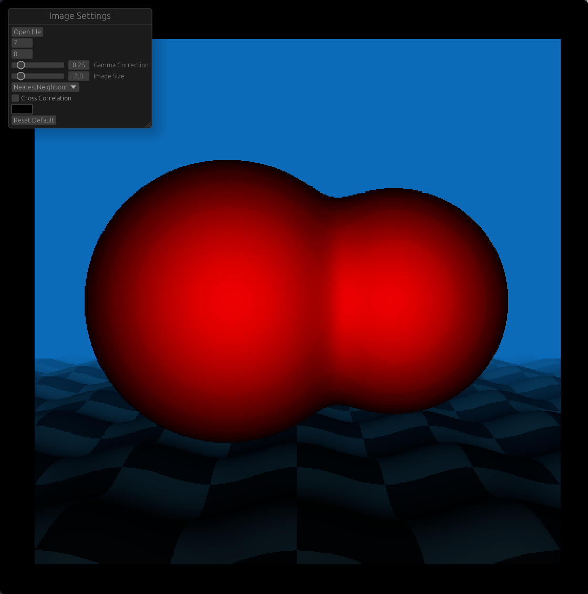
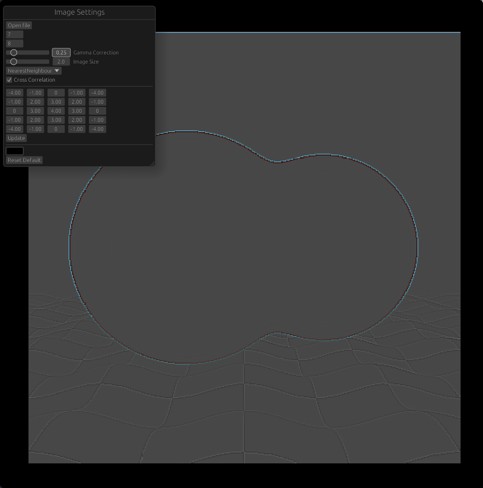

# Image Manipulation Tool

[Try it!](https://editor.vivianeris.com/)

Image manipulation program built using Rust, wgpu and egui

All computation is performed in parallel on the GPU

The techniques implemented are:
* Gamma Correction
* Nearest Neighbor Interpolation
* Bilinear Interpolation
* Cross Correlation with Laplacian (by default)

The kernel used for cross correlation can be modified to use any values

New Images can be loaded using the Load button

## Examples





## Improvements

Currently the implemented technique for to find the minimum and maximum for use in the normalization step is slow and inefficient. I tried implemented Parallel Reductions as described in GPU Gems Chapter 37 but was unable to get it to work.

Save functionality would be nice as well.

## Build Instructions

For a native binary:

```
cargo build --release
cargo run --release
```

---

For a native web version this can be compiled to WASM using `wasm-pack`

`wasm-pack` can be installed via cargo

```
wasm-pack build --target web
```
